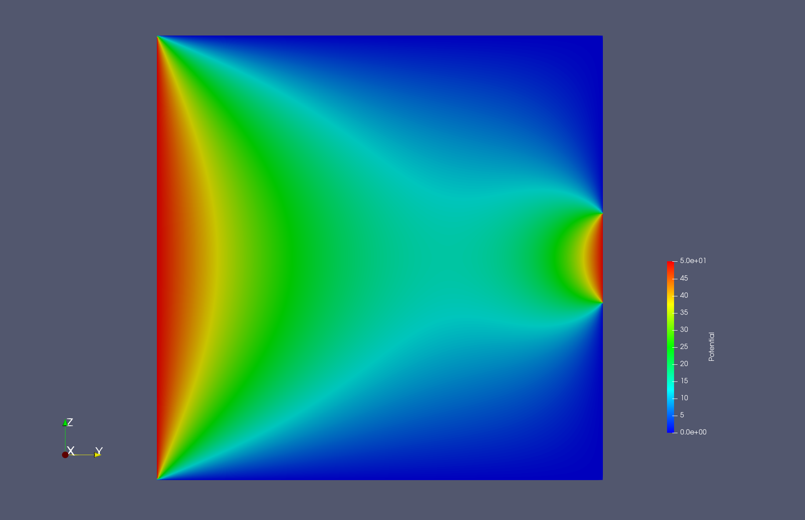

# Diffusion solver

This program solves the Laplace equation with different boundary conditions on a rectangular structured grid.

It takes a problem input file as input and produces two binary files with the potential and flux fields as well as an XDMF file that describes the grid and the data formats, which you can open with Paraview or ViSit.

The following is a temperature distribution on a square plate with the temperature fixed along its edges.



## Usage

```
./diffusion <input-file>
```

As of now, the solver has a hardcoded condition to terminate after 5 million iterations if the convergence criterion is not met. This is a temporary solution, functionality to allow the user to configure both the convergence criterion and the maximum iteration count needs to be implemented.

### Input file format

The first line of the file defines the grid and has the following format:

```
WIDTH HEIGHT PHYSICAL_WIDTH PHYSICAL_HEIGHT FIELD_NAME
```

Where:
* `WIDTH`: Integer grid width.
* `HEIGHT`: Integer grid height.
* `PHYSICAL_WIDTH`: Physical width of the domain.
* `PHYSICAL_HEIGHT`: Physical height of the domain.
* `FIELD_NAME`: The name of the field (e.g. Temperature).

After these options have been given, the boundary conditions are defined in separate lines with the following format:

```
BOUNDARY TYPE START END VALUE
```

All grid indices are zero-indexed and the end values are not inclusive.

`BOUNDARY` can be one of: `X-`, `X+`, `Y-`, `Y+`.

`TYPE` can be either `DIRICHLET` or `NEUMANN`. For Neumann boundary conditions the value represents the outflow thus an inlet's flowrate would be negative.

The parts of the grid's boundary that are not explicitly set get an implicit no-flow condition.

## Building

The solver can be built like any CMake C project. Simply create a build directory, switch to it and run cmake with the options you want.

A simple release build sequence would look like:

```
mkdir build
cd build
cmake .. -DCMAKE_BUILD_TYPE=Release
make
```

To build the program with double precision floating point numbers, set `USE_DOUBLES=1`.